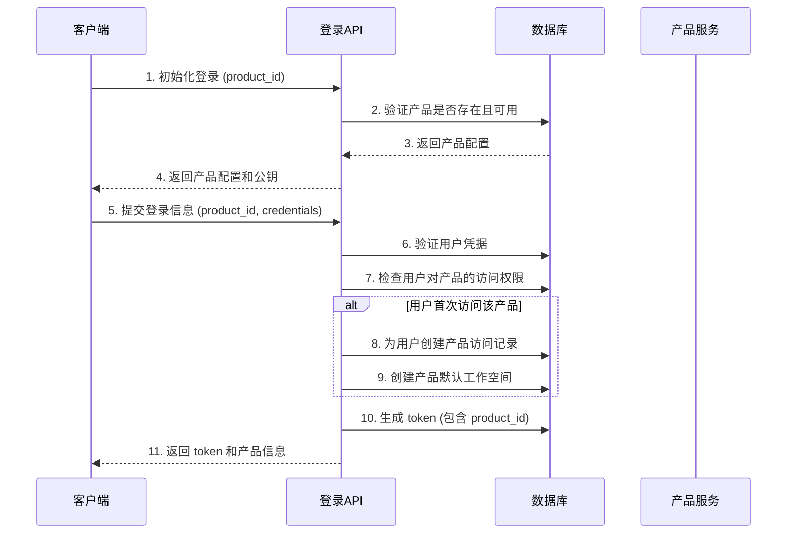

# 多产品统一登录系统设计方案

## 1. 架构概述

基于现有的 liubai 登录系统，设计一套支持多产品的统一认证架构。核心思想是：
- **统一用户身份**：一个用户账号可以登录多个产品
- **产品标识区分**：通过 product_id 区分不同产品
- **数据隔离**：每个产品有独立的工作空间和数据
- **权限管理**：支持产品级别的权限控制

## 2. 数据库设计扩展

### 2.1 新增产品配置表 `Table_Product`

```typescript
interface Table_Product extends BaseTable {
  product_id: string          // 产品唯一标识，如 "liubai", "product2"
  product_name: string        // 产品显示名称
  product_desc?: string       // 产品描述
  domain: string              // 产品域名
  logo?: Cloud_ImageStore     // 产品 logo
  theme?: ProductTheme        // 产品主题配置
  status: "active" | "inactive" | "maintenance"  // 产品状态
  
  // OAuth 配置（每个产品可以有独立的 OAuth 配置）
  oauth_config?: {
    github?: {
      client_id: string
      client_secret: string
    }
    google?: {
      client_id: string
      client_secret: string
    }
    // 其他 OAuth 提供商...
  }
  
  // 产品特定配置
  features?: string[]         // 启用的功能列表
  limits?: ProductLimits      // 产品限制配置
  
  owner: string               // 产品所有者
  admins?: string[]           // 产品管理员列表
}

interface ProductTheme {
  primary_color?: string
  secondary_color?: string
  logo_url?: string
  favicon_url?: string
}

interface ProductLimits {
  max_users?: number          // 最大用户数
  max_workspaces?: number     // 最大工作空间数
  storage_limit?: number      // 存储限制（KB）
}
```

### 2.2 扩展用户表 `Table_User`

```typescript
// 在现有 Table_User 基础上新增字段
interface Table_User extends BaseTable {
  // ... 现有字段 ...
  
  // 新增多产品相关字段
  products?: UserProductAccess[]  // 用户可访问的产品列表
  default_product?: string        // 默认产品 ID
  last_product?: string           // 最后使用的产品 ID
}

interface UserProductAccess {
  product_id: string
  role: "owner" | "admin" | "member" | "guest"
  joined_at: number
  last_access?: number
  permissions?: string[]          // 产品内的具体权限
}
```

### 2.3 扩展工作空间表 `Table_Workspace`

```typescript
// 在现有 Table_Workspace 基础上新增字段
interface Table_Workspace extends BaseTable {
  // ... 现有字段 ...
  
  // 新增产品关联字段
  product_id: string              // 所属产品 ID
}
```

### 2.4 扩展成员表 `Table_Member`

```typescript
// 在现有 Table_Member 基础上新增字段
interface Table_Member extends BaseTable {
  // ... 现有字段 ...
  
  // 新增产品关联字段
  product_id: string              // 所属产品 ID
}
```

## 3. API 接口设计

### 3.1 登录接口扩展

所有现有登录接口都需要支持 `product_id` 参数：

#### 3.1.1 初始化接口
```http
POST /user-login
Content-Type: application/json

{
  "operateType": "handle_init",
  "product_id": "liubai"  // 新增必填参数
}
```

#### 3.1.2 邮箱登录
```http
POST /user-login
Content-Type: application/json

{
  "operateType": "handle_email",
  "product_id": "liubai",     // 新增必填参数
  "enc_email": "...",
  "state": "..."
}
```

#### 3.1.3 OAuth 登录
```http
POST /user-login
Content-Type: application/json

{
  "operateType": "handle_github_oauth",
  "product_id": "liubai",     // 新增必填参数
  "code": "...",
  "state": "..."
}
```

### 3.2 新增产品管理接口

#### 3.2.1 获取产品列表
```http
GET /product-management
Content-Type: application/json

{
  "operateType": "get_products"
}

// 响应
{
  "code": "0000",
  "data": {
    "products": [
      {
        "product_id": "liubai",
        "product_name": "闪记",
        "domain": "liubai.com",
        "logo": {...},
        "status": "active"
      }
    ]
  }
}
```

#### 3.2.2 创建产品
```http
POST /product-management
Content-Type: application/json

{
  "operateType": "create_product",
  "product_id": "new_product",
  "product_name": "新产品",
  "domain": "newproduct.com",
  "oauth_config": {...}
}
```

### 3.3 用户产品权限接口

#### 3.3.1 获取用户可访问的产品
```http
POST /user-products
Content-Type: application/json

{
  "operateType": "get_user_products"
}

// 响应
{
  "code": "0000",
  "data": {
    "products": [
      {
        "product_id": "liubai",
        "product_name": "闪记",
        "role": "member",
        "last_access": 1640995200000
      }
    ],
    "default_product": "liubai"
  }
}
```

#### 3.3.2 切换产品
```http
POST /user-products
Content-Type: application/json

{
  "operateType": "switch_product",
  "product_id": "target_product"
}
```

## 4. 认证流程设计

### 4.1 登录流程



### 4.2 Token 设计

扩展现有 Token 结构，增加产品信息：

```typescript
interface Table_Token extends BaseTable {
  // ... 现有字段 ...
  
  // 新增产品相关字段
  product_id: string              // 当前 token 关联的产品
  product_permissions?: string[]  // 产品内权限
}
```

### 4.3 权限验证

在所有需要权限验证的接口中，增加产品级别的权限检查：

```typescript
// 权限验证中间件
async function verifyProductAccess(token: Table_Token, requiredPermission?: string) {
  // 1. 验证用户对产品的访问权限
  const user = await getUserById(token.userId)
  const productAccess = user.products?.find(p => p.product_id === token.product_id)
  
  if (!productAccess) {
    throw new Error("用户无权访问该产品")
  }
  
  // 2. 验证具体权限
  if (requiredPermission && !productAccess.permissions?.includes(requiredPermission)) {
    throw new Error("权限不足")
  }
  
  return productAccess
}
```

## 5. 数据隔离策略

### 5.1 工作空间隔离

- 每个产品的工作空间通过 `product_id` 字段进行隔离
- 查询工作空间时必须带上 `product_id` 条件
- 用户在不同产品中可以有不同的工作空间

### 5.2 内容隔离

- 所有内容（Content、Draft、Collection 等）都通过关联的工作空间实现产品隔离
- 查询时需要验证工作空间的 `product_id`

### 5.3 成员隔离

- 成员表增加 `product_id` 字段
- 同一用户在不同产品中可以有不同的成员身份和权限

## 6. 实施步骤

### 阶段一：数据库扩展
1. 创建 `Table_Product` 表
2. 扩展现有表结构，增加 `product_id` 字段
3. 数据迁移：为现有数据设置默认 `product_id`

### 阶段二：API 接口改造
1. 修改登录相关接口，支持 `product_id` 参数
2. 增加产品管理接口
3. 修改权限验证逻辑

### 阶段三：前端适配
1. 登录页面增加产品选择
2. 用户界面显示当前产品信息
3. 支持产品切换功能

### 阶段四：测试和部署
1. 单元测试和集成测试
2. 数据迁移测试
3. 生产环境部署

## 7. 安全考虑

### 7.1 产品隔离安全
- 严格的数据查询过滤，防止跨产品数据泄露
- Token 中包含产品信息，防止跨产品访问
- 定期审计产品访问权限

### 7.2 权限管理
- 产品级别的权限控制
- 支持细粒度的功能权限
- 管理员权限分离

### 7.3 审计日志
- 记录用户的产品访问日志
- 记录产品配置变更日志
- 记录权限变更日志

## 8. 监控和运维

### 8.1 监控指标
- 各产品的用户活跃度
- 产品间的用户流转情况
- 登录成功率和失败率

### 8.2 运维工具
- 产品配置管理界面
- 用户权限管理界面
- 数据迁移工具

## 9. 扩展性考虑

### 9.1 支持更多认证方式
- 企业 SSO 集成
- LDAP 认证
- 多因素认证

### 9.2 支持更多产品类型
- SaaS 产品
- 移动应用
- 桌面应用

### 9.3 支持产品间数据共享
- 用户画像共享
- 内容跨产品同步
- 统一搜索功能